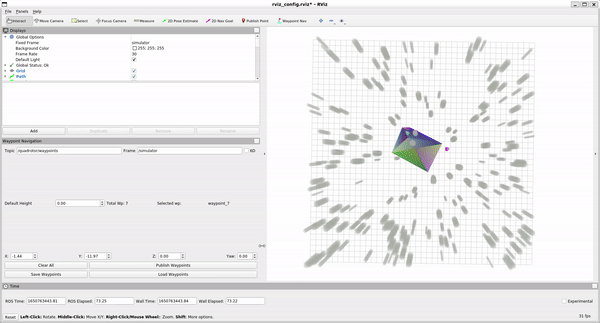

# 2D Simplicial Complex Construction and Visualization
This project is able to generate and visualize the simplicial complex in a simulation environment using ROS.

To use this project, firstly you can download and set up the environment following the instructions in [this Github repository](https://github.com/yuwei-wu/Fast-Planner). Then, you can replace the `src` folder you just created when setting up the environment with the `src` folder in this Github repository. Finally, you can build the project using `catkin build`.

To run the code:

Terminal 1:

```
roslaunch plan_manage  rviz.launch
```
Terminal 2:

```
roslaunch plan_manage  fast.launch sim:=true vicon:=false mav_name:=quadrotor random_map:=true
```

Terminal 3:

```
roslaunch simplicial_complex simplicial_complex.launch
```

Terminal 4:

```
rosrun rqt_mav_manager rqt_mav_manager
```

